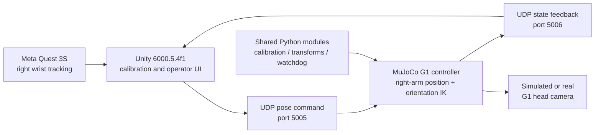

# G1 Quest 3S Teleoperation

Meta Quest 3S의 오른손 hand tracking을 Unity에서 수집하고, UDP로 전달한 목표 자세를 MuJoCo의 Unitree G1 29DoF 모델에 적용하는 텔레오퍼레이션 프로젝트다.

이 프로젝트의 핵심은 단순한 VR 입력 전달이 아니라 **영점 보정, 좌표계 변환, clutch 기반 재연결, 속도 제한, workspace 감시, watchdog, 관절 제한, 충돌 회피를 포함한 실시간 로봇 제어 파이프라인**을 구성하는 데 있다.

## 핵심 기능

- Quest 3S 오른손 위치·회전 추적과 Unity 내 상태 시각화
- 손목 정렬 후 동작을 시작하는 zero-jump calibration / clutch 방식
- G1 오른팔 위치와 자세를 분리한 damped IK
  - 손목 베이스 위치: 어깨 3축 + 팔꿈치 1축
  - 손 자세: 손목 3축
- 입력 위치·회전 속도 제한과 마지막 안전 목표 유지
- session/sequence watchdog과 오래된 송신자 takeover 처리
- workspace debounce, fault latch, 관절 범위 제한, 오른팔-몸통 접촉 검사
- MuJoCo 머리 카메라 시뮬레이션과 실제 D435i 전환을 위한 공통 카메라 계층
- Quest 없이 UDP·IK 경로를 점검하는 가짜 입력 도구와 Python 단위 테스트

## 시스템 흐름



현재 실행 경로는 Unity가 오른손 목표를 UDP로 송신하고, `g1_right_arm_udp_ik_demo.py`가 이를 수신해 MuJoCo G1 오른팔을 제어하는 구조다. 상세 설계는 [`docs/ARCHITECTURE.md`](docs/ARCHITECTURE.md), 통신 계약과 마이그레이션 계획은 [`docs/PROTOCOL.md`](docs/PROTOCOL.md)에 정리되어 있다.

## 빠른 실행

### 요구 환경

- Windows
- Unity `6000.5.4f1`
- Python `3.11`
- Python 패키지 `mujoco`, `numpy`
- Meta Horizon Link와 Quest Link
- Unity 프로젝트에 선언된 Meta XR / XR Hands 패키지

루트 실행 스크립트는 현재 다음 Unity 설치 경로를 확인한다.

```text
C:\Program Files\Unity\Hub\Editor\6000.5.4f1\Editor\Unity.exe
```

설치 위치가 다르면 `START_VR_HAND_TO_MUJOCO.bat`의 `UNITY_EXE` 값을 수정해야 한다.

### 1. 환경 점검

PowerShell에서 프로젝트 루트로 이동한 뒤 실행한다.

```powershell
.\START_VR_HAND_TO_MUJOCO.bat --check
```

이 명령은 Unity 프로젝트, Python 3.11, MuJoCo·NumPy, UDP 5005 포트, Unity 실행 상태를 확인한다.

### 2. 전체 실행

```powershell
.\START_VR_HAND_TO_MUJOCO.bat
```

그다음 다음 순서로 진행한다.

1. Meta Horizon Link에서 Quest Link 연결을 확인한다.
2. Unity에서 `Assets/Scenes/SampleScene`을 연다.
3. Unity Play를 누른다.
4. Quest에서 청록색 손목 마커를 흰색 시작점에 맞춘다.
5. 마커가 노란색인 동안 약 `0.55초` 정지한다.
6. 마커가 초록색으로 바뀌면 오른손 이동과 회전이 MuJoCo로 전달된다.

상태 색상은 다음과 같다.

| 색상 | 의미 |
| --- | --- |
| 청록색 | 실제 Quest 손목 위치 |
| 흰색 | 정렬 대기 |
| 노란색 | 정렬 완료, engagement 대기 |
| 초록색 | 텔레오퍼레이션 활성 |
| 주황색 | G1 workspace 제한 감지 |

### 3. Quest 없이 제어 경로 점검

```powershell
.\tools\TEST_FAKE_VR_TO_MUJOCO.bat
```

가짜 오른손 좌표를 전송해 UDP 수신, clutch, IK, workspace, 상태 피드백 경로를 점검한다.

## 저장소 구조

```text
.
├─ Unity_G1_Quest3S/          # Quest 3S 입력, calibration UI, G1 표시
├─ MuJoCo_G1_Controller/      # G1 모델, 오른팔 IK, 시뮬레이션 실행 코드
├─ backend/
│  ├─ g1_teleop/              # 공통 Python 모듈
│  ├─ tests/                  # calibration/protocol/watchdog/IK 테스트
│  └─ tools/                  # backend 보조 도구
├─ config/                    # 카메라와 실행 프로필
├─ docs/                      # 아키텍처, 프로토콜, 카메라 문서
├─ tools/                     # 빌드·진단·가짜 입력·카메라 검증 BAT
├─ START_VR_HAND_TO_MUJOCO.bat
└─ README.md
```

### 핵심 구현 경로

| 경로 | 역할 |
| --- | --- |
| `Unity_G1_Quest3S/Assets/G1Teleop/` | 손 목표 연결, UDP 송신, G1 상태 수신과 시각화 |
| `backend/g1_teleop/calibration.py` | 중립 자세 보정, 안정성 검사, workspace scale 추정 |
| `backend/g1_teleop/protocol.py` | 버전이 명시된 pose/state JSON 계약 |
| `backend/g1_teleop/transforms.py` | pose·quaternion·좌표 변환 |
| `backend/g1_teleop/watchdog.py` | sequence/session 감시, workspace debounce와 fault latch |
| `backend/g1_teleop/camera*.py` | 시뮬레이션/실제 카메라 공통 인터페이스 |
| `MuJoCo_G1_Controller/scripts/g1_right_arm_udp_ik_demo.py` | 현재 사용하는 G1 오른팔 UDP IK 실행기 |
| `backend/tests/` | 핵심 수학·프로토콜·안전 동작 회귀 테스트 |

### 외부 코드와 참고 자산

다음 경로에는 프로젝트 실행을 위해 포함한 외부 SDK·모델·참고 코드가 많다.

- `MuJoCo_G1_Controller/external/unitree_mujoco/`
- `Unity_G1_Quest3S/Assets/Bhaptics/`
- `Unity_G1_Quest3S/Assets/Plugins/InControl/`
- Unity Package Manager가 관리하는 Meta XR, XR Hands, XR Interaction Toolkit 패키지

프로젝트를 검토할 때는 먼저 위의 **핵심 구현 경로**를 확인하는 것이 좋다. 외부 구성요소의 저작권과 배포 조건은 각 하위 라이선스를 따른다.

## 제어 및 안전 설계

### Calibration과 clutch

사용자 손과 로봇 손목의 중립 자세를 기준으로 상대 변위를 계산한다. engagement 시점의 로봇 자세를 보존하기 때문에 제어가 활성화되는 순간 목표가 갑자기 튀는 현상을 줄인다.

Calibration 데이터는 일정 수의 샘플을 모은 뒤 위치·회전 RMS를 검사해, 사용자가 움직이는 동안 잘못된 중립 자세가 저장되는 것을 방지한다.

### 좌표계

```text
Unity operator frame : +X right, +Y up, +Z forward
MuJoCo G1 frame      : +X forward, +Y left, +Z up
```

현재 위치 변환은 다음 대응을 사용한다.

```text
robot = (operator.z, -operator.x, operator.y)
```

### IK

- 위치 오차는 damped pseudoinverse로 계산한다.
- 위치 task는 어깨·팔꿈치 관절에 우선 적용한다.
- 손목 자세는 손목 3축에 분리 적용해 손목 회전 때문에 팔꿈치가 불필요하게 움직이지 않도록 한다.
- elbow pole reference와 preferred posture를 null space에 적용해 사람과 유사한 팔 자세를 유지한다.
- 관절 스텝을 제한하고, 충돌이 발생하면 line search로 스텝을 줄여 다시 시도한다.

### 실패 시 동작

| 상황 | 동작 |
| --- | --- |
| 짧은 tracking loss | 마지막 안전 목표를 유지 |
| 동일 sequence 재수신 | packet 거부 |
| 다른 session의 송신자가 동시에 접근 | 기존 session이 stale 상태가 될 때까지 거부 |
| 순간적인 workspace 초과 | 목표를 제한하고 debounce 시간 동안 관찰 |
| 지속적인 workspace 초과 | clutch 해제 및 재정렬 요구 |
| 오른팔-몸통 충돌 예상 | 스텝 축소 후 실패 시 이전 자세 유지 |

## 테스트

Python 테스트는 표준 `unittest`로 구성되어 있다.

```powershell
py -3.11 -m unittest discover -s backend\tests -p "test_*.py" -v
```

현재 테스트 범위에는 다음 항목이 포함된다.

- calibration 중립 자세 mapping과 rigid registration
- pose protocol 입력 검증
- sequence/session watchdog
- workspace debounce와 fault latch
- 카메라 frame 계약과 shared memory layout
- MuJoCo IK 수학과 trajectory 동작

실제 Quest Link, Unity Play mode, MuJoCo viewer까지 포함한 end-to-end 확인은 수동 통합 테스트로 수행한다.

## 문서

- [`docs/ARCHITECTURE.md`](docs/ARCHITECTURE.md): 전체 계층, 데이터 흐름, 안전 책임, 리팩터링 방향
- [`docs/PROTOCOL.md`](docs/PROTOCOL.md): 현재 UDP packet, 기존 V1 계약, 통합 시 주의점과 단계별 마이그레이션
- [`docs/CAMERA_SIMULATION_GUIDE.md`](docs/CAMERA_SIMULATION_GUIDE.md): MuJoCo 머리 카메라와 실제 D435i 전환
- [`MuJoCo_G1_Controller/README.md`](MuJoCo_G1_Controller/README.md): MuJoCo 제어기 중심 설명

## 현재 구조에서 확인된 개선 과제

1. Unity의 실제 UDP packet과 `backend/g1_teleop/protocol.py`의 버전 계약을 하나로 통합한다.
2. UDP 포트, workspace, timeout, 속도 제한 값을 공통 configuration으로 이동한다.
3. `g1_right_arm_udp_ik_demo.py`에서 scene, transport, IK, safety, runtime status 책임을 분리한다.
4. backend를 최종 safety authority로 정하고 Unity는 상태 표시와 사용자 interaction에 집중시킨다.
5. CI에서 Python 테스트와 Unity 프로젝트 정적 검증을 자동화한다.

현재 live packet과 버전 프로토콜 사이에는 session ownership 및 command-state 표현 차이가 있으므로, 즉시 교체하지 않고 [`docs/PROTOCOL.md`](docs/PROTOCOL.md)의 호환 마이그레이션 순서를 따른다.
