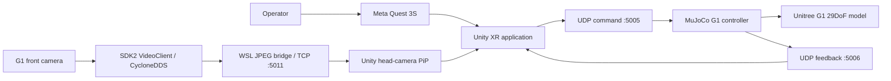
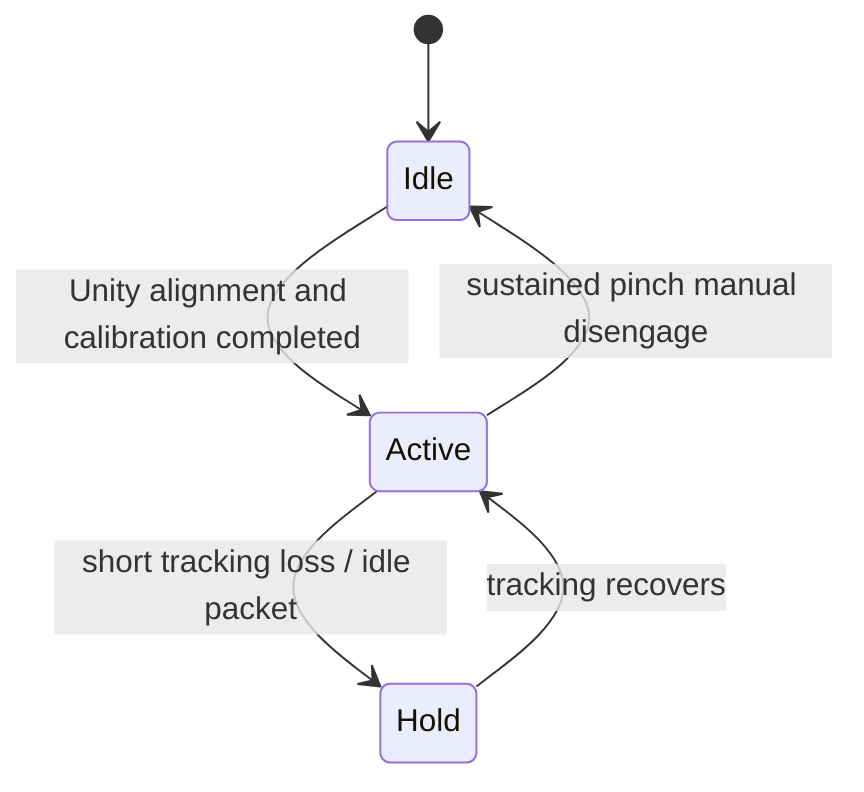

# Teleoperation Architecture

현재 코드의 읽기 순서·수식·실제 파라미터는 [CODE_GUIDE](CODE_GUIDE.md)를 참고한다.
[파일 색인](CODE_INDEX.md)은 코드/설정 파일의 목록과 확인 범위를 구분한다.
2026-09-03 미사용 DLS/voxel/monkey-patch 정리 내역은 [정리 기록](CLEANUP_20260903.md)에 있다.

## 1. 목적과 범위

이 문서는 VR에서 추적한 사용자 손목 자세를 MuJoCo의 Unitree G1 오른팔 움직임으로 변환하는 현재 구조를 설명한다. 또한 실제 G1, 실제 D435i, 양팔 제어로 확장할 때 유지해야 할 책임 경계와 리팩터링 순서를 정의한다.

현재 프로젝트의 핵심 목표는 다음과 같다.

1. engagement 순간 목표가 튀지 않는 hand-to-robot mapping
2. tracking 지연·유실·중복 packet에 대한 예측 가능한 동작
3. workspace, 관절 범위, 몸통 충돌을 고려한 안전한 IK
4. Unity, MuJoCo, 실제 로봇이 공유할 수 있는 통신·좌표 계약
5. Quest나 실물 장비 없이도 핵심 로직을 테스트할 수 있는 구조

---

## 2. 시스템 컨텍스트



### 현재 end-to-end 경로

```text
Quest right wrist pose
→ Unity hand binding and engagement UI
→ legacy UDP JSON command
→ strict legacy packet adapter
→ session/sequence ownership watchdog
→ active/hold/workspace-fault command state
→ clutch-relative target calculation
→ G1 right-arm Mink 6D QP IK
→ joint/velocity/collision constraints and non-arm DOF freeze
→ MuJoCo state update
→ UDP state feedback to Unity
```

루트의 `START_VR_HAND_TO_MUJOCO.bat`이 현재 실행 진입점이며, 다음 두 프로세스를 연다.

- Unity 프로젝트 `Unity_G1_VR`
- 기본 MuJoCo 실행기 `MuJoCo_G1_Controller/scripts/run_mink_g1_right_arm_virtual_center_live.py`
- `run_mink_g1_right_arm_prototype.py`는 공통 모듈이며 `--baseline`에서만 직접 실행

---

## 3. 계층별 책임

### 3.1 Unity operator layer

주요 경로:

```text
Unity_G1_VR/Assets/G1Teleop/
```

책임:

- Quest XR Hands 입력 획득
- 실제 손목과 engagement target 표시
- calibration/engagement 사용자 경험 제공
- 사용자 손 이동을 현재 로봇 목표로 mapping
- UDP command 송신
- MuJoCo state feedback 수신 및 HUD 반영

대표 구성요소:

| 구성요소 | 책임 |
| --- | --- |
| `G1ExistingHandTargetBinder` | 추적 손목과 target 연결, calibration 상태 관리 |
| `G1ExistingTargetUdpSender` | 목표 위치·회전, session, sequence, command state 송신 |
| `G1RobotStateUdpReceiver` | UDP 5006 Mink 피드백과 UDP 5010 실제 G1 표시 상태를 출처별로 분리 수신 |
| `G1OfficialRig` 및 관련 클래스 | 이름 순서가 검증된 29관절 상태를 Unity G1 모델에 표시 |
| `G1HeadCameraPiP` | 로컬 TCP 5011의 검증된 JPEG를 수신해 시야 고정 창에 표시 |

Unity는 사용자의 입력과 피드백을 담당하지만, 장기적으로는 최종 안전 판정을 내리는 계층이 되어서는 안 된다. Unity가 중단되거나 packet이 조작되더라도 backend/controller가 독립적으로 안전 상태를 유지해야 한다.

머리 카메라 PiP는 별도의 관측 경로다. 영상 연결 상태는 engagement, IK,
watchdog 또는 모터 명령을 변경하지 않는다. 전신/base telemetry는 진단과 모델
재생에 유지하지만, 운용자는 실제 환경과 이동 결과를 PiP로 직접 확인한다.

### 3.2 Shared Python foundation

주요 경로:

```text
backend/g1_teleop/
```

| 모듈 | 책임 |
| --- | --- |
| `calibration.py` | 중립 pose, 안정성 검사, workspace scale, rigid registration |
| `transforms.py` | pose matrix, quaternion, 좌표 변환 |
| `protocol.py` | 버전이 명시된 command/state JSON 계약과 검증 |
| `command_adapter.py` | 현재 legacy command와 V2 packet을 공통 내부 명령으로 변환 |
| `live_receiver.py` | non-blocking UDP queue drain, strict parsing, session/sequence 적용 |
| `runtime_state.py` | idle, active, hold, workspace-fault 상태 전이 |
| `mink_command_stream.py` | Mink 실행기용 clutch 보존, timeout hold, session 인계 처리 |
| `watchdog.py` | sequence/session 감시, timeout, workspace debounce/fault latch |
| `camera.py` | 공통 camera frame/intrinsics 계약 |
| `camera_factory.py` | simulation과 real D435i source 선택 |
| `g1_camera_mount.py` | G1 D435i 장착 pose |
| `unitree_image_transport.py` | Unitree simulation image shared memory transport |

이 계층은 Unity 또는 MuJoCo에 종속되지 않는 순수 로직의 중심이어야 한다. 가능한 기능은 여기로 이동해 단위 테스트 가능성을 높인다.

### 3.3 MuJoCo control layer

현재 launcher가 사용하는 핵심 파일:

```text
MuJoCo_G1_Controller/scripts/run_mink_g1_right_arm_virtual_center_live.py
```

공통 모듈 및 명시적 baseline 비교 실행기:

```text
MuJoCo_G1_Controller/scripts/run_mink_g1_right_arm_prototype.py
```

현재 제어 계층의 책임:

- command-line argument 처리
- G1 XML 읽기와 demo scene 생성
- UDP socket과 공통 command stream 연결
- clutch reference 생성
- 오른팔 Mink QP task와 constraint 구성
- joint/velocity/collision 제한
- 비오른팔 DOF freeze
- runtime status 저장
- Unity state feedback
- MuJoCo viewer

packet 검증과 상태 관리는 `backend/g1_teleop`으로 분리되었다. scene 생성과
Mink task orchestration은 아직 실행기에 남아 있으므로 이후 단계에서 추가 분리한다.

### 3.4 Configuration and operations

```text
config/
tools/
docs/
```

- `config`: 카메라 source와 실행 프로필
- `tools`: build, fake input, camera verification, diagnostics
- `docs`: architecture, protocol, camera operation

현재 motion/workspace/network 값의 일부가 Unity Inspector와 Python 상수에 중복되어 있다. 이 값들은 공통 configuration으로 옮기되, Unity build에서 읽을 수 있는 배포 방식까지 함께 설계해야 한다.

---

## 4. 좌표계와 pose mapping

### 4.1 현재 축 정의

```text
Unity operator frame
+X = right
+Y = up
+Z = forward

MuJoCo G1 frame
+X = forward
+Y = left
+Z = up
```

위치 변환은 다음 basis를 사용한다.

```text
robot.x = operator.z
robot.y = -operator.x
robot.z = operator.y
```

행렬 형태는 다음과 같다.

```text
[ 0  0  1 ]
[-1  0  0 ]
[ 0  1  0 ]
```

현재 이 변환 개념이 Unity와 Python 양쪽에 존재한다. 동일 변환을 두 번 적용하거나 한쪽만 수정하는 오류를 막기 위해 최종 구조에서는 다음 원칙을 권장한다.

```text
Unity     : 원본 operator-frame pose와 추적 상태 송신
Foundation: canonical robot-frame pose로 변환
Controller: robot-specific target와 safety 적용
```

### 4.2 Clutch-relative mapping

engagement 시 다음 기준을 저장한다.

- 사용자의 입력 위치와 회전
- 로봇의 실제 손목 위치와 회전
- shoulder-elbow-wrist로 계산한 elbow pole reference

이후 사용자의 상대 변화량만 로봇 기준 pose에 더한다.

```text
target_position
= robot_position_at_engagement
+ current_input_position
- input_position_at_engagement
```

회전도 engagement 이후의 상대 회전만 적용한다. 따라서 사용자가 target에 손을 맞추는 동안의 절대 오프셋이 로봇에 갑자기 전달되지 않는다.

G1 손목의 engagement marker에 손을 맞추고 0.55초 유지하면 engage한다.
Engagement 순간의 사용자 손 pose와 G1의 현재 손목 pose를 별도 기준으로
저장하므로 target jump가 없다. Engage 후 엄지-검지 pinch를 0.50초 유지하면
수동으로 disengage한다.

---

## 5. 오른팔 제어 구조

### 5.1 현재 role-separated 6D task

기본 launcher는 위치와 회전을 두 task로 분리한다.

- position: `right_wrist_roll_link`, cost `8.0`
- orientation: `right_wrist_yaw_link`, cost `2.0`
- gain: `0.35`
- LM damping: `1e-5`
- solver: DAQP 우선

오른팔 7개 관절로 손목 6D 목표를 풀며, engagement 때 저장한 사용자 손목과
실제 G1 손목의 상대 변화만 적용한다. Unity에 보이는 외부 손목 frame은 계속
`right_wrist_yaw_link`다.

### 5.2 자연스러운 해 선택

`PostureTask`가 engagement 시점 자세를 기준으로 불필요한 관절 이동을 줄인다.
별도 `DampingTask`는 shoulder/elbow 쪽 비용을 손목보다 크게 두어 단순 손목
회전에서 팔꿈치가 과도하게 따라오는 해를 억제한다.

### 5.3 QP 제약

각 60 Hz step에서 다음 제약을 함께 푼다.

1. MuJoCo 관절 위치 범위인 `ConfigurationLimit`
2. 어깨·팔꿈치 40 deg/s, 손목 100 deg/s인 `VelocityLimit`
3. geometry 간 최소 거리와 감지 거리를 사용하는 `CollisionAvoidanceLimit`
4. 오른팔 외 모든 DOF 속도를 0으로 만드는 `DofFreezingTask`

목표를 먼저 계산한 뒤 사후 clamp하는 구조가 아니라 task와 제한을 같은 QP에
포함한다.

### 5.4 Baseline 비교 경로

현재 메인 launcher는 `run_mink_g1_right_arm_virtual_center_live.py`를 기본으로
사용한다. `--baseline`을 명시할 때만 `right_wrist_yaw_link` 하나에 위치와 회전을
모두 둔 이전 단일 6D `FrameTask` 제어기를 실행한다.

---

## 6. 안전 상태와 실패 처리

### 6.1 입력 상태



`MinkCommandStream`은 hold에서 마지막 target과 clutch reference를 유지한다.
tracking loss나 packet timeout만으로 재정렬하지 않는다. 사용자의 sustained
pinch와 오래된 sender를 대체하는 새 session만 clutch reference를 초기화한다.

### 6.2 안전 메커니즘

| 메커니즘 | 목적 |
| --- | --- |
| sequence watchdog | 중복·역순 packet 거부 |
| session watchdog | 동시에 실행된 오래된 Unity sender와 충돌 방지 |
| timeout hold | 입력 중단 시 새 목표 갱신을 멈추고 마지막 관절 상태 유지 |
| direct Cartesian reference | 초록 목표를 필터링된 사용자 손 목표에 직접 배치 |
| sustained pinch disengage | 사용자가 의도적으로 즉시 clutch를 해제 |
| Mink velocity limit | 관절 속도를 QP 내부에서 제한 |
| configuration limit | MuJoCo 관절 범위 준수 |
| collision avoidance | 지정 geometry 간 거리를 QP 내부에서 제한 |
| non-arm DOF freeze | 오른팔 외 관절의 의도치 않은 이동 차단 |

### 6.3 현재 safety authority 문제

현재 live 경로는 Unity의 직육면체 workspace와 주황 경고를 사용하지 않는다.
backend는 초록 목표를 필터링된 사용자 손 목표에 즉시 배치한다. 별도의
Cartesian 속도 제한이나 오차 임계값으로 초록 목표를 지연·승인·되돌리지 않는다.
로봇만 Mink의 joint velocity, configuration, collision constraint 아래에서
초록 목표를 추종한다.

외부 위치 계약은 `right_wrist_yaw_link`이다. 내부 위치 Task는
`right_wrist_roll_link`를 사용하므로 매 제어 주기마다 현재
`yaw_position - roll_position` 오프셋을 외부 목표에서 빼 내부 중심 목표를
만든다. 따라서 손목 회전으로 링크 간 오프셋이 바뀌어도 초록 목표는 Unity가
보낸 손목 위치를 지나치거나 뒤처지지 않는다.
`use_rectangular_workspace_fallback=false`이면 Unity UDP 송신기 역시 직육면체
clamp를 적용하지 않으며, 화면에 표시한 목표와 같은 값을 보낸다.

Quest 손 추적이 재획득되며 손목 위치가 한 프레임에 20 cm를 넘게 순간이동하면
실제 손동작으로 사용하지 않는다. 중립 손목 기준을 동일한 이동량만큼 보정해
현재 로봇 목표를 유지한다. 같은 재획득 구간의 회전 중립 기준도 함께 보정하고,
이후 프레임부터 연속적인 상대 위치와 회전만 반영한다.

따라서 현재 동작 계약은 다음과 같다.

```text
tracking loss / idle / UDP timeout -> hold, clutch 유지
sustained pinch                    -> idle, clutch 초기화
return and explicit realignment     -> 새 clutch 기준으로 active
```

Unity 시각화는 파란 원을 사용자 손목, 초록 원을 필터링된 직접 명령 목표,
분홍 원을 실제 G1 손목으로 표시한다. 흰 선은 파란 원과 분홍 원을 연결해 현재
이동 방향을 보여준다.

목표 구조:

```text
Unity
- tracking validity
- operator UI
- warning display
- re-alignment interaction

Backend/controller
- packet validity
- session ownership
- workspace decision
- timeout state
- final target acceptance
- collision and joint safety
```

Unity가 보내는 `active` 요청은 명령일 뿐이며, controller가 최종적으로 허용한 상태만 로봇에 적용해야 한다.

---

## 7. 현재 통신 경계

현재 live command는 `G1ExistingTargetUdpSender.cs`가 생성하는 legacy packet을
사용한다. 이 packet도 `command_adapter.py`에서 `session_id`, `sequence`,
`command_state`, pose 형식까지 엄격하게 검증한다. 반면
`backend/g1_teleop/protocol.py`에는 versioned V1/V2 계약이 별도로 정의되어
있다.

두 계약은 아직 동일하지 않다.

- live packet에는 `session_id`, `command_state`, `right.pos`, `right.rot`이 있다.
- V2에는 `schema`, `session_id`, `frame_id`, head, 양쪽 wrist, `armed`, `clutch`가 있다.
- V2 packet은 strict parse할 수 있지만 현재 raw tracking-frame mapping이 완료되지 않아 live control 권한은 비활성화되어 있다.

따라서 V2를 즉시 live packet으로 교체하지 않는다. 좌표 mapping과 장비 회귀
검증을 마친 뒤 호환 마이그레이션을 [`PROTOCOL.md`](PROTOCOL.md)에 따라
진행한다.

또한 MuJoCo UDP receiver는 현재 `0.0.0.0:5005`에 bind한다. 로컬 PC에서만 사용할 경우 `127.0.0.1` bind 또는 firewall 제한이 더 안전하다. 현재 UDP packet에는 인증·암호화가 없으므로 외부 네트워크에 그대로 노출하면 안 된다.

### 7.1 Physical G1 read-only display boundary

```text
G1 rt/lowstate + rt/odommodestate
    -> WSL SDK2/CycloneDDS subscribers (read-only)
    -> first odometry sample = relative base origin
    -> UDP 5009 strict 29-joint + optional base-state telemetry
    -> MuJoCo full-body and relative-base mirror + display interpolation
    -> g1_unity_state_bridge.py
    -> UDP 5010 state_source=g1_lowstate_read_only
       (the exact MuJoCo-displayed joints/base + source/display diagnostics)
    -> Unity official G1 rig
```

UDP 5006은 `state_source=mink_simulation`인 제어 시뮬레이션 피드백으로 유지한다.
`G1ExistingTargetUdpSender`의 workspace/collision 판단은 계속 5006만 사용한다.
UDP 5010은 실제 G1 또는 저장 LowState의 전신 시각화 전용이며 어떤 target이나
motor command도 생성하지 않는다. Unity 프리뷰는 신선한 5010 전신 상태를
우선하고, 없으면 5006 Mink 상태를 표시한다. 두 출처를 한 수신기에 섞지 않는다.

29개 motor angle은 관절 articulation을 복원하고, 별도의
`rt/odommodestate`가 base 위치와 IMU 방향을 보완한다. 실행마다 첫 유효 base
sample을 원점/identity로 정규화해 절대 odometry jump를 제거한다. MuJoCo는
고정-base 모델의 `pelvis` body transform만 관찰용으로 이동하고, Unity는 같은
상대 pose를 G1 root에 적용한다. base topic이 없거나 stale이어도 29관절 경로는
중단하지 않고 마지막 base pose를 유지한다. 두 DDS 경로 모두 subscriber-only다.

5010은 5009 원본을 MuJoCo보다 먼저 전달하지 않는다. MuJoCo가 해당 프레임에
실제로 적용한 보간 관절/base 자세를 Unity에도 보내므로 두 화면의 표시 자세는
동일하다. `g1_visual_mirror_*.jsonl`은 원본 G1 자세, MuJoCo 표시 자세, Unity에
명령한 동일 표시 자세와 그 차이를 기록한다. Unity는 실제 root transform과
5010 표시 자세의 위치/회전 오차를 `G1 BASE MIRROR` 로그로 추가 검증한다.

### 7.2 Physical G1 Gate 6 command boundary

Regular Mode에서 하체 motion service를 유지하는 실제 G1 상체 경로는
`rt/lowcmd`가 아니라 공식 `rt/arm_sdk`를 사용한다.
여기서 Regular Mode는 G1이 평평한 지면에서 두 발로 자립하고 하체 motion
service가 균형을 유지하는 운용 상태를 뜻한다. 공중에 매달린 상태에서 얻은
읽기 전용 결과는 DDS/관절 동기화 검증에는 사용할 수 있지만 실제 Gate 6
출력을 승인하지 않는다.

```text
G1 rt/lowstate
    -> fresh 29-joint measured state
    -> MotionSwitcher signature check
    -> dual-arm measured-pose HOLD validation
    -> 35-slot HG LowCmd construction + CRC
    -> explicit authorization gate
    -> rt/arm_sdk
```

G1 Arm SDK의 `motor_cmd[29].q`는 motion service와 사용자 양팔 명령 사이의
전역 blend weight다. 따라서 오른팔만 움직일 계획이어도 publisher 최초 획득
시점에는 왼팔과 오른팔 14축을 모두 실측값으로 시드하고 검증한다. 동적으로
갱신하는 관절은 15~28번뿐이며 허리 12~14번과 하체는 command mode와 gain을
0으로 유지한다.

Gate 6 publisher는 read-only forwarder와 분리되어 있다. 기본 실행은
publisher를 import하거나 생성하지 않는 준비 검사다. 실제 출력 분기는 최신
`DIRECT_TELEOP_READY`, config authorization, command 승인 문구, 지상 자립
Regular 확인 문구를 모두 요구한다.
영구 config authorization은 `false`다. 사용자 확인과 1회용 승인 설정으로
최대 weight `0.2` measured-pose HOLD를 한 번 완료했지만 live Mink target은
아직 실제 G1에 전송하지 않았다.

### 7.3 Locked Gate 7 Mink target adapter

Gate 7은 Gate 6의 publisher를 활성화하지 않은 채 live-target 계약만 분리해
검증하는 오프라인 경계다.

```text
Mink state mirror (UDP 5008)
    -> schema/session/sequence/watchdog validation
    -> active: right-arm target rate limit
    -> intentional pinch: collision-prevalidated dual-arm minimum-jerk return
    -> tracking/network/workspace/collision fault: hold measured pose for 10 s
    -> fault persists for 10 s: same collision-prevalidated Regular return
    -> valid active input recovers before 10 s: cancel timer and resume tracking
    -> SDK-neutral 35-slot Arm SDK candidate frame
    -> [hardware authorization remains false]
```

Unity는 이미 `pinch_disengaged`와 `tracking_disengaged`를 구분해 송신한다.
`MinkCommandStream`은 Mink의 계산 상태와 별도로 그 원본 mode를 보존한다.
그러므로 추적 손실을 사용자 의도와 혼동하지 않는다. 의도적 pinch는 즉시 복귀하고,
의도치 않은 해제는 10초간 현재 측정 자세를 유지한 뒤에만 복귀한다.

의도적 pinch 복귀 목표는 `config/g1_regular_arm_pose.json`에 저장된 실측
Regular 양팔 14축이다. Arm SDK blend weight가 양팔 전체에 적용되므로 복귀는
15~28번을 함께 계획하지만, 허리와 하체는 계속 command 대상에서 제외한다.
복귀 경로 전체가 MuJoCo/Mink collision pair에서 12 mm 이상인지 먼저 검증하지
못하면 움직임 후보를 생성하지 않는다. 실제 publisher, DDS entity, Unitree SDK
호출은 이 경계에 포함되지 않는다.

현재 복귀는 저장된 양팔 관절 자세를 만드는 오프라인 command 후보다. 휴대용
조종기는 향후 비상정지와 운용 모드 전환 수단으로 유지한다. 실제 G1 내부 Regular
제어기에 양팔 권한을 넘기는 Arm SDK weight release와 모드 확인은 별도의 지상
실기 Gate이며 이 오프라인 경계에는 구현하거나 승인하지 않았다.

### 7.4 Gate 7 live dry-run

`gate7_live_dry_run.py`는 UDP 5008의 실제 Mink stream을 같은 Gate 7 계약에
연속 입력하며 SDK-neutral `ArmSdkCommandFrame`과 JSONL 로그를 만든다. 같은
후보의 시뮬레이션 전용 복사본만 localhost UDP 5012로 MuJoCo에 되돌린다.

```text
Unity UDP 5005 -> Mink/MuJoCo -> UDP 5008
    -> Gate7TeleopController at 250 Hz
    -> measured/target age and 10 deg validation
    -> 35-slot Arm SDK candidate
    +-> JSONL
    `-> UDP 5012 simulation_only feedback
        -> MuJoCo applies REGULAR_RETURN / REGULAR_HOLD only
    -> no Unitree SDK, DDS entity, publisher or physical command
```

기본 `mink` 모드는 후보를 이상적으로 추종하는 shadow plant로 사용한다. 선택적
`lowstate` 모드는 UDP 5007의 29관절 측정값을 사용해 실제 자세 대비 후보 오차와
250 ms stale 차단을 검증한다. 이 모드는 로봇이 실제로 후보를 따라 움직이지 않기
때문에 목표가 측정값에서 10도 이상 벌어지면 의도대로 후보가 차단된다.

5012 receiver는 Unity command가 inactive이고 packet age가 250 ms 이하일 때만
복귀 상태를 적용한다. 정확히 양팔 15~28번 qpos만 바꾸며 하체와 허리는 유지한다.
`simulation_only=true`, `hardware_output_authorized=false`가 아닌 packet은
거부하므로 이 경로를 실제 G1 출력으로 재사용할 수 없다.

---

## 8. 목표 구조

대규모 이동을 한 번에 수행하지 않고 다음 경계를 목표로 한다.

```text
backend/g1_teleop/
├─ calibration.py
├─ transforms.py
├─ protocol.py
├─ config.py
├─ watchdog.py
│
├─ control/
│  ├─ ik.py
│  ├─ trajectory.py
│  ├─ workspace.py
│  ├─ collision.py
│  └─ limits.py
│
├─ transport/
│  ├─ udp_command.py
│  ├─ udp_state.py
│  └─ unitree_image.py
│
└─ simulation/
   ├─ scene_builder.py
   ├─ model.py
   └─ camera.py

MuJoCo_G1_Controller/scripts/
└─ run_mink_g1_right_arm.py  # future orchestration-only entry point
```

목표 실행기의 책임은 다음 수준으로 줄인다.

```python
config = load_config()
model = create_simulation(config)
transport = create_transport(config)
controller = RightArmController(model, config)

while running:
    command = transport.receive_latest()
    state = controller.step(command)
    transport.publish_state(state)
```

---

## 9. 단계별 리팩터링 계획

### Phase 1 — 문서와 계약 고정

- README에서 core implementation과 third-party 영역 구분
- 현재/목표 architecture 문서화
- legacy packet과 versioned protocol 차이 명시

### Phase 2 — Protocol adapter

- backend에 legacy packet parser를 독립 모듈로 이동
- 신규 packet을 동시에 받을 수 있는 adapter 추가
- malformed, duplicate, stale-session 테스트 강화

### Phase 3 — Configuration 중앙화

- network, workspace, timeout, rate limit 값을 공통 schema로 정의
- Python loader와 Unity importer를 각각 구현
- 시작 시 effective configuration을 로그로 남김

### Phase 4 — Control 분리

- pure IK math 이동
- safe reference trajectory 이동
- workspace/collision 정책 이동
- scene XML generation 이동
- 기존 함수 기반 테스트를 새 모듈에 그대로 연결

### Phase 5 — Authority 정리

- backend/controller를 최종 safety authority로 지정
- Unity의 중복 safety 로직은 표시·사용자 interaction 중심으로 축소
- state feedback을 versioned contract로 통합

### Phase 6 — Automation

- Python unit test CI
- JSON/YAML schema 검증
- Unity batchmode compile validation
- 문서 링크와 핵심 파일 존재 여부 검사

---

## 10. 테스트 전략

### Unit tests

장비 없이 검증할 항목:

- pose/quaternion validation
- calibration stability와 neutral mapping
- coordinate conversion
- sequence/session watchdog
- workspace debounce와 latch
- rate limiter
- IK pseudoinverse, null-space posture, elbow pole
- collision step rollback

### Integration tests

프로세스 수준 검증:

- fake sender → MuJoCo controller
- Unity editor sender → MuJoCo controller
- controller → Unity state feedback
- SDK2 `VideoClient.GetImageSample` → 완전한 JPEG 검사
- WSL camera bridge → TCP 5011 → Unity 시야 고정 PiP

### Manual hardware tests

- Quest Link tracking continuity
- engagement 시 target jump 여부
- workspace 경계에서 초록 목표 projection과 관절 제한 동작
- 실제 G1 `videohub` frame의 갱신·stale·재연결 동작
- 장시간 실행 중 session 재시작과 recovery

---

## 11. 외부 구성요소 경계

다음은 실행에 필요한 외부 코드·자산 영역이다.

```text
MuJoCo_G1_Controller/external/unitree_mujoco/
Unity Package Manager dependencies
```

리팩터링 시 이 영역을 프로젝트 고유 제어 코드와 섞지 않는다. 외부 파일을 수정해야 한다면 변경 이유와 upstream 기준 commit/tag를 별도 문서나 patch로 남기는 것이 좋다.
