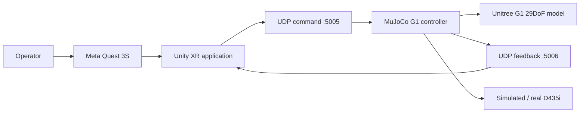
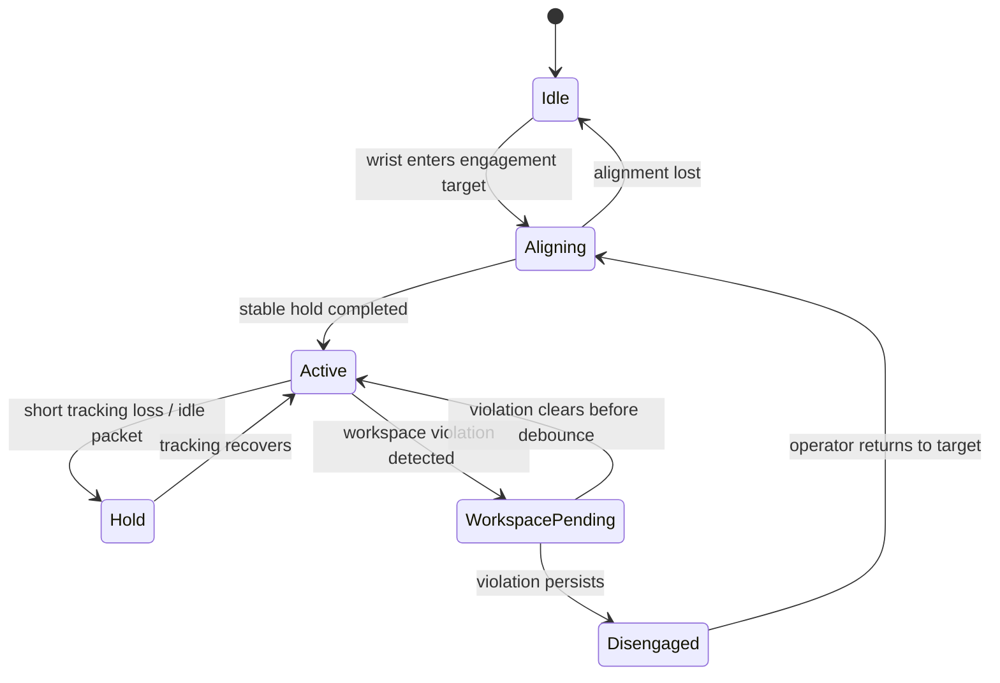

# Teleoperation Architecture

## 1. 목적과 범위

이 문서는 Quest 3S에서 추적한 사용자 손목 자세를 MuJoCo의 Unitree G1 오른팔 움직임으로 변환하는 현재 구조를 설명한다. 또한 실제 G1, 실제 D435i, 양팔 제어로 확장할 때 유지해야 할 책임 경계와 리팩터링 순서를 정의한다.

현재 프로젝트의 핵심 목표는 다음과 같다.

1. engagement 순간 목표가 튀지 않는 hand-to-robot mapping
2. tracking 지연·유실·중복 packet에 대한 예측 가능한 동작
3. workspace, 관절 범위, 몸통 충돌을 고려한 안전한 IK
4. Unity, MuJoCo, 실제 로봇이 공유할 수 있는 통신·좌표 계약
5. Quest나 실물 장비 없이도 핵심 로직을 테스트할 수 있는 구조

---

## 2. 시스템 컨텍스트



### 현재 end-to-end 경로

```text
Quest right wrist pose
→ Unity hand binding and engagement UI
→ legacy UDP JSON command
→ session/sequence watchdog
→ clutch-relative target calculation
→ position/rotation rate limiter
→ G1 right-arm damped IK
→ joint limit and collision line search
→ MuJoCo state update
→ UDP state feedback to Unity
```

루트의 `START_VR_HAND_TO_MUJOCO.bat`이 현재 실행 진입점이며, 다음 두 프로세스를 연다.

- Unity 프로젝트 `Unity_G1_VR`
- MuJoCo 실행기 `MuJoCo_G1_Controller/scripts/g1_right_arm_udp_ik_demo.py`

---

## 3. 계층별 책임

### 3.1 Unity operator layer

주요 경로:

```text
Unity_G1_VR/Assets/G1Teleop/
```

책임:

- Quest XR Hands 입력 획득
- 실제 손목과 engagement target 표시
- calibration/engagement 사용자 경험 제공
- 사용자 손 이동을 현재 로봇 목표로 mapping
- UDP command 송신
- MuJoCo state feedback 수신 및 HUD 반영

대표 구성요소:

| 구성요소 | 책임 |
| --- | --- |
| `G1ExistingHandTargetBinder` | 추적 손목과 target 연결, calibration 상태 관리 |
| `G1ExistingTargetUdpSender` | 목표 위치·회전, session, sequence, command state 송신 |
| `G1RobotStateUdpReceiver` | 오른팔 상태와 workspace/collision feedback 수신 |
| `G1OfficialRig` 및 관련 클래스 | Unity G1 모델과 관절 표시 |

Unity는 사용자의 입력과 피드백을 담당하지만, 장기적으로는 최종 안전 판정을 내리는 계층이 되어서는 안 된다. Unity가 중단되거나 packet이 조작되더라도 backend/controller가 독립적으로 안전 상태를 유지해야 한다.

### 3.2 Shared Python foundation

주요 경로:

```text
backend/g1_teleop/
```

| 모듈 | 책임 |
| --- | --- |
| `calibration.py` | 중립 pose, 안정성 검사, workspace scale, rigid registration |
| `transforms.py` | pose matrix, quaternion, 좌표 변환 |
| `protocol.py` | 버전이 명시된 command/state JSON 계약과 검증 |
| `watchdog.py` | sequence/session 감시, timeout, workspace debounce/fault latch |
| `camera.py` | 공통 camera frame/intrinsics 계약 |
| `camera_factory.py` | simulation과 real D435i source 선택 |
| `g1_camera_mount.py` | G1 D435i 장착 pose |
| `unitree_image_transport.py` | Unitree simulation image shared memory transport |

이 계층은 Unity 또는 MuJoCo에 종속되지 않는 순수 로직의 중심이어야 한다. 가능한 기능은 여기로 이동해 단위 테스트 가능성을 높인다.

### 3.3 MuJoCo control layer

현재 핵심 파일:

```text
MuJoCo_G1_Controller/scripts/g1_right_arm_udp_ik_demo.py
```

현재 한 파일이 맡는 책임:

- command-line argument 처리
- G1 XML 읽기와 demo scene 생성
- 카메라 추가
- UDP socket과 packet parsing
- session watchdog
- clutch reference 생성
- safe position/rotation reference 생성
- 오른팔 IK
- joint/workspace/collision 제한
- runtime status 저장
- Unity state feedback
- MuJoCo viewer와 camera publication

기능은 충분하지만 책임이 과도하게 집중되어 있다. 다음 리팩터링 단계에서는 pure math, transport, scene, orchestration을 분리해야 한다.

### 3.4 Configuration and operations

```text
config/
tools/
docs/
```

- `config`: 카메라 source와 실행 프로필
- `tools`: build, fake input, camera verification, diagnostics
- `docs`: architecture, protocol, camera operation

현재 motion/workspace/network 값의 일부가 Unity Inspector와 Python 상수에 중복되어 있다. 이 값들은 공통 configuration으로 옮기되, Unity build에서 읽을 수 있는 배포 방식까지 함께 설계해야 한다.

---

## 4. 좌표계와 pose mapping

### 4.1 현재 축 정의

```text
Unity operator frame
+X = right
+Y = up
+Z = forward

MuJoCo G1 frame
+X = forward
+Y = left
+Z = up
```

위치 변환은 다음 basis를 사용한다.

```text
robot.x = operator.z
robot.y = -operator.x
robot.z = operator.y
```

행렬 형태는 다음과 같다.

```text
[ 0  0  1 ]
[-1  0  0 ]
[ 0  1  0 ]
```

현재 이 변환 개념이 Unity와 Python 양쪽에 존재한다. 동일 변환을 두 번 적용하거나 한쪽만 수정하는 오류를 막기 위해 최종 구조에서는 다음 원칙을 권장한다.

```text
Unity     : 원본 operator-frame pose와 추적 상태 송신
Foundation: canonical robot-frame pose로 변환
Controller: robot-specific target와 safety 적용
```

### 4.2 Clutch-relative mapping

engagement 시 다음 기준을 저장한다.

- 사용자의 입력 위치와 회전
- 로봇의 실제 손목 위치와 회전
- shoulder-elbow-wrist로 계산한 elbow pole reference

이후 사용자의 상대 변화량만 로봇 기준 pose에 더한다.

```text
target_position
= robot_position_at_engagement
+ current_input_position
- input_position_at_engagement
```

회전도 engagement 이후의 상대 회전만 적용한다. 따라서 사용자가 target에 손을 맞추는 동안의 절대 오프셋이 로봇에 갑자기 전달되지 않는다.

---

## 5. 오른팔 제어 구조

### 5.1 Position task

기본 position body는 `right_wrist_roll_link`다.

- 사용 관절: shoulder pitch/roll/yaw + elbow
- 계산: damped pseudoinverse
- 보조 목적:
  - preferred posture
  - elbow lateral avoidance
  - elbow pole reference

position task가 우선이며 보조 목적은 null space에서 적용된다.

### 5.2 Orientation task

기본 orientation body는 `right_wrist_yaw_link`다.

- 사용 관절: wrist roll/pitch/yaw
- 위치 task가 만든 arm rotation 영향을 뺀 뒤 wrist residual을 계산
- 손목 회전 때문에 elbow가 따라가는 현상을 억제

### 5.3 Step acceptance

각 IK update는 다음 순서를 따른다.

1. damped IK delta 계산
2. 최대 관절 스텝으로 clipping
3. 현재 qpos 저장
4. step gain을 줄이는 line search 수행
5. joint limit 적용
6. 오른팔-몸통 접촉 검사
7. 안전한 후보가 없으면 이전 qpos 복원

이 구조는 목표 추종보다 충돌 없는 상태 유지를 우선한다.

---

## 6. 안전 상태와 실패 처리

### 6.1 입력 상태



### 6.2 안전 메커니즘

| 메커니즘 | 목적 |
| --- | --- |
| sequence watchdog | 중복·역순 packet 거부 |
| session watchdog | 동시에 실행된 오래된 Unity sender와 충돌 방지 |
| timeout hold/disarm | 입력 중단 시 안전 상태 전환 |
| workspace clamp | 순간적인 범위 초과가 큰 target jump로 이어지는 것을 방지 |
| workspace debounce | 짧은 tracking noise 때문에 즉시 disengage되는 것을 방지 |
| workspace fault latch | 재정렬 없이 fault가 임의로 해제되지 않도록 함 |
| position/rotation rate limit | packet 간 큰 목표 변화 제한 |
| joint clamp | MuJoCo joint range와 운영 범위 준수 |
| torso keep-out | 손목·팔꿈치가 몸통 안쪽으로 진입하는 것을 제한 |
| collision line search | 충돌 후보 step을 줄여 재시도하고 실패 시 이전 상태 유지 |

### 6.3 현재 safety authority 문제

현재 workspace 판단과 일부 re-engagement 로직이 Unity와 MuJoCo 양쪽에 존재한다. 두 구현의 값이나 상태 전이가 달라지면 UI 상태와 실제 제어 상태가 어긋날 수 있다.

목표 구조:

```text
Unity
- tracking validity
- operator UI
- warning display
- re-alignment interaction

Backend/controller
- packet validity
- session ownership
- workspace decision
- timeout state
- final target acceptance
- collision and joint safety
```

Unity가 보내는 `active` 요청은 명령일 뿐이며, controller가 최종적으로 허용한 상태만 로봇에 적용해야 한다.

---

## 7. 현재 통신 경계

현재 live command는 `G1ExistingTargetUdpSender.cs`가 생성하는 legacy packet을 사용한다. 반면 `backend/g1_teleop/protocol.py`에는 `PosePacketV1`과 `StatePacketV1`이 별도로 정의되어 있다.

두 계약은 아직 동일하지 않다.

- live packet에는 `session_id`, `command_state`, `right.pos`, `right.rot`이 있다.
- `PosePacketV1`에는 `schema`, `frame_id`, `head`, 양쪽 wrist, `armed`, `clutch`가 있다.
- 현재 session ownership은 live packet에 의존하지만 `PosePacketV1`에는 `session_id`가 없다.

따라서 V1을 즉시 live packet으로 교체하면 현재 watchdog 의미가 사라질 수 있다. 호환 마이그레이션은 [`PROTOCOL.md`](PROTOCOL.md)를 따른다.

또한 MuJoCo UDP receiver는 현재 `0.0.0.0:5005`에 bind한다. 로컬 PC에서만 사용할 경우 `127.0.0.1` bind 또는 firewall 제한이 더 안전하다. 현재 UDP packet에는 인증·암호화가 없으므로 외부 네트워크에 그대로 노출하면 안 된다.

---

## 8. 목표 구조

대규모 이동을 한 번에 수행하지 않고 다음 경계를 목표로 한다.

```text
backend/g1_teleop/
├─ calibration.py
├─ transforms.py
├─ protocol.py
├─ config.py
├─ watchdog.py
│
├─ control/
│  ├─ ik.py
│  ├─ trajectory.py
│  ├─ workspace.py
│  ├─ collision.py
│  └─ limits.py
│
├─ transport/
│  ├─ udp_command.py
│  ├─ udp_state.py
│  └─ unitree_image.py
│
└─ simulation/
   ├─ scene_builder.py
   ├─ model.py
   └─ camera.py

MuJoCo_G1_Controller/scripts/
└─ g1_right_arm_udp_ik_demo.py  # orchestration only
```

목표 실행기의 책임은 다음 수준으로 줄인다.

```python
config = load_config()
model = create_simulation(config)
transport = create_transport(config)
controller = RightArmController(model, config)

while running:
    command = transport.receive_latest()
    state = controller.step(command)
    transport.publish_state(state)
```

---

## 9. 단계별 리팩터링 계획

### Phase 1 — 문서와 계약 고정

- README에서 core implementation과 third-party 영역 구분
- 현재/목표 architecture 문서화
- legacy packet과 versioned protocol 차이 명시

### Phase 2 — Protocol adapter

- backend에 legacy packet parser를 독립 모듈로 이동
- 신규 packet을 동시에 받을 수 있는 adapter 추가
- malformed, duplicate, stale-session 테스트 강화

### Phase 3 — Configuration 중앙화

- network, workspace, timeout, rate limit 값을 공통 schema로 정의
- Python loader와 Unity importer를 각각 구현
- 시작 시 effective configuration을 로그로 남김

### Phase 4 — Control 분리

- pure IK math 이동
- safe reference trajectory 이동
- workspace/collision 정책 이동
- scene XML generation 이동
- 기존 함수 기반 테스트를 새 모듈에 그대로 연결

### Phase 5 — Authority 정리

- backend/controller를 최종 safety authority로 지정
- Unity의 중복 safety 로직은 표시·사용자 interaction 중심으로 축소
- state feedback을 versioned contract로 통합

### Phase 6 — Automation

- Python unit test CI
- JSON/YAML schema 검증
- Unity batchmode compile validation
- 문서 링크와 핵심 파일 존재 여부 검사

---

## 10. 테스트 전략

### Unit tests

장비 없이 검증할 항목:

- pose/quaternion validation
- calibration stability와 neutral mapping
- coordinate conversion
- sequence/session watchdog
- workspace debounce와 latch
- rate limiter
- IK pseudoinverse, null-space posture, elbow pole
- collision step rollback

### Integration tests

프로세스 수준 검증:

- fake sender → MuJoCo controller
- Unity editor sender → MuJoCo controller
- controller → Unity state feedback
- simulated head camera → shared memory reader

### Manual hardware tests

- Quest Link tracking continuity
- engagement 시 target jump 여부
- workspace 경계에서 clamp/disengage 동작
- 실제 D435i frame와 simulation frame 교체
- 장시간 실행 중 session 재시작과 recovery

---

## 11. 외부 구성요소 경계

다음은 실행에 필요한 외부 코드·자산 영역이다.

```text
MuJoCo_G1_Controller/external/unitree_mujoco/
Unity_G1_VR/Assets/Bhaptics/
Unity_G1_VR/Assets/Plugins/InControl/
Unity Package Manager dependencies
```

리팩터링 시 이 영역을 프로젝트 고유 제어 코드와 섞지 않는다. 외부 파일을 수정해야 한다면 변경 이유와 upstream 기준 commit/tag를 별도 문서나 patch로 남기는 것이 좋다.